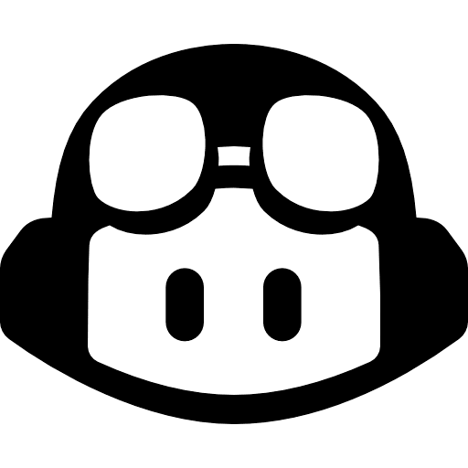
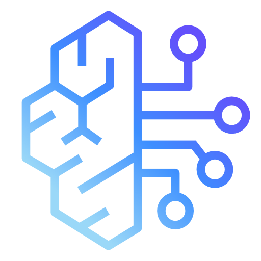

<p align="center">
  
</p>

<h1 align="center">MCP Knowledge Infrastructure</h1>
<h3 align="center">Corporate Policy as an AI-Ready Service</h3>
<p align="center"><strong>Jason Pittman, Cloud Security & Architecture | March 2026</strong></p>

---

## Vision

Serve Warner Bros. Discovery's security baselines, architecture standards, and compliance requirements as live, queryable services that any approved AI tool can consume — so engineering can easily adhere to corporate policy automatically.

Beyond developer tooling, applications, deployment pipelines, internal portals, compliance dashboards — can also query the same knowledge servers programmatically.


---

## Challenge

Engineers are expected to follow corporate security baselines. The baselines live across dozens of Confluence pages. Engineers don't always know what applies, where to find it. Resulting in non-compliance.

Engineers are already using AI tools to enhance code efforts. Those tools don't currently know WBD policy. They generate output that looks right but may violate baselines.  
Probably cought by review but slowed down time to delivery.

---

## Proposed Solution

<p align="center">
  
</p>

**MCP (Model Context Protocol)** is an open standard — created by Anthropic and adopted across the AI industry. This proposal is for utilizing MCP to connect AI tools to corporate knowledge. We build containerized MCP servers that index our Confluence documentation and serve it to any approved AI tool in real-time.

When an engineer asks an approved AI tool — Cursor, Copilot, Bedrock — to generate infrastructure, the tool automatically retrieves the applicable WBD baselines before generating output. Compliance becomes the default.

Security teams can leverage the same infrastructure to streamline architecture reviews — pulling applicable baselines, compliance mappings, and prior findings automatically instead of investigating from scratch every time.

Another enhancment could be using RAG (Retrieval-Augmented Generation), to index historical data — past review decisions, exception requests, incidents — improving recommendations over time.

---

## Example of What We Could Serve

| MCP Server | Serves | Example Query |
|-----------|--------|---------------|
| Cloud Baselines | AWS / Azure / GCP security baselines | "S3 encryption requirements" |
| Architecture Standards | Approved patterns, services, naming | "Cross-account access pattern" |
| Compliance | CIS / SOX / PCI mappings | "CIS controls for RDS" |
| IAM Policies | Role definitions, least-privilege standards | "Validate this IAM policy" |
| Skills | Pre-built review and generation workflows | "Review this architecture" |

Content auto-syncs from Confluence daily. When baselines update, every engineer's next query gets current policy. No manual distribution.

---

## What Tools Can Use This

MCP is an open standard adopted across the AI industry. WBD builds the MCP servers — any approved tool connects. 

---

### Code Assistance — Approved & MCP Ready Now

<table>
<tr>
<td width="80" align="center"><br/><sub><b>GitHub CoPilot</b></sub></td>
<td><b>Approved</b> · MCP: <b>Yes — Native</b><br/>Copilot agent mode calls MCP tools. Org-level admin via GitHub Enterprise. Engineers get baselines in Copilot today.</td>
</tr>
<tr>
<td width="80" align="center"><br/><sub><b>Cursor</b></sub></td>
<td><b>Approved</b> · MCP: <b>Yes — Native</b><br/>Native MCP in settings. Shared <code>.cursor/mcp.json</code> config pushable to all users. Engineers get baselines in Cursor today.</td>
</tr>
<tr>
<td width="80" align="center"><br/><sub><b>AWS Bedrock</b></sub></td>
<td><b>Approved</b> · MCP: <b>Yes — Via Agents</b><br/>Bedrock agents call MCP-compatible tools via Lambda. Powers custom agents, autonomous review, chatbots. Stays within AWS boundary.</td>
</tr>
</table>

**Local device configuration:** MCP connections are defined in a simple JSON config file on the engineer's machine (e.g., `.cursor/mcp.json`, Copilot's org-level settings). The org can push these configs centrally — via GitHub admin console, managed dotfiles, or onboarding tooling — so engineers' tools point to WBD's MCP servers from day one. No manual setup, zero tribal knowledge required.

---

*Other approved WBD AI tools (Microsoft Copilot for Web, Office 365 CoPilot, Zoom AI, Miro, Adobe Firefly, Descript, Canva, Figma, AI Creative Studio, Trint) do not currently support MCP. Microsoft is expanding MCP support across its Copilot products — We will want to monitor for updates.*

---

### Not Yet Approved — MCP-Native (Seeking Approval) Powerfull 
<table>
<tr>
<td width="80" align="center"><br/><sub><b>Claude Code Enterprise</b></sub></td>
<td><b>Anthropic</b> · MCP: <b>Native (first-class)</b><br/>Built by MCP creators. Deepest MCP integration. SSO, audit logging, data governance, custom system prompts, org-wide MCP configs. Anthropic's Claude models already power Amazon Bedrock — a platform WBD leverages heavily today. Claude Code Enterprise extends that existing investment from API to developer tooling. This tool's evolution as the leading agentic coding platform is accelerating rapidly — early adoption positions WBD ahead of the curve.</td>
</tr>
</table>

---

---

## Impact

| Today | With MCP |
|-------|----------|
| Engineer must find the right Confluence page | AI retrieves applicable baselines automatically |
| Compliance depends on individual knowledge | Compliance is the default regardless of experience |
| Policy violations caught at review (weeks later) | Policy applied at point of generation (immediately) |
| Security reviews start from scratch | Reviews arrive pre-analyzed with findings cited to source |
| Each AI project builds its own baseline ingestion | One shared knowledge layer serves all projects and tools |
| No audit trail for AI-assisted work | Every query logged — who, what, when, which baseline |

---

## Cloud Security Deliverables

| # | Deliverable | What It Is |
|---|------------|-----------|
| 1 | **MCP Knowledge Platform** | Confluence baselines indexed and served as queryable MCP tools. Cloud Security as reference implementation. |
| 2 | **MCP Baseline & Starter Kit** | Security standards for building MCP servers + reusable package any team can deploy for their own docs. |
| 3 | **MCP Registry** | Central catalog of all MCP servers — what's available, who owns it, how to connect. |
| 4 | **Autonomous Architecture Review Agent** | Agent pre-screens Cloud Security Architecture Reviews using MCP knowledge. Reviewers verify, not investigate. |

---

## Security & Legal

- **Data stays internal.** MCP servers and vector databases run on WBD infrastructure. No corporate documentation leaves the network.
- **Local embeddings.** Document processing uses a local model — no content sent to external APIs.
- **Audit trail.** Every query logged with user identity, query text, results, and source document version.
- **Tool-agnostic.** MCP is an open standard. Whichever AI tools pass WBD's approval process can connect.
- **No training on WBD data.** Enterprise AI agreements (Anthropic, OpenAI, AWS) contractually prohibit using customer data for model training.
- **M&A ready.** Containerized, configuration-driven infrastructure. Portable, auditable, documentable for due diligence.

---

## Infrastructure & Cost

### Deployment Path

| Phase | Hosting | Annual Cost | Details |
|-------|---------|-------------|---------|
| **POC** | Docker Compose on a single VM | **$0 – $1,800** | One `docker-compose up`. Prove the value, tune the RAG pipeline. |
| **Production** | AWS Serverless (ECS Fargate + Aurora pgvector) | **$1,200 – $3,200** | No servers to manage. Scales to near-zero when idle. Fully defined in Terraform. |
Azure, GCP, and OCI solutions exist at similar cost, but our existing Direct Connect footprint globally makes AWS the natural fit — keeping these MCP servers behind the corporate firewall with engineers accessing them over GlobalProtect.

Production stack: **Lambda** scrapes Confluence nightly - **Bedrock Titan** generates embeddings - **Aurora pgvector** stores vectors - **ECS Fargate** runs MCP servers - **API Gateway + WAF** authenticates and routes requests. All private networking, KMS encryption, CloudWatch monitoring, and IAM least-privilege included.

**Adding a new team's MCP server in production is one Terraform module block:**

```hcl
module "grc_baselines_mcp" {
  source = "./modules/mcp-server"
  name   = "gict-terraform-standards"
  image  = "${module.registry.repository_url}:gict-terraform-standards-latest"
  port   = 8104
}
# terraform apply - deployed, registered, monitored, secured
```

### How Any Team Deploys Their Own MCP

**Cloud Security builds the platform and leads by example.** Once the pattern is proven, teams can stand up their own MCP server for their domain knowledge using the same infrastructure and starter kit.

**Example of where this goes next:**

| Team | What They'd Serve | Example Query |
|------|-------------------|---------------|
| AWS Infrastructure | Approved TF modules, landing zone patterns, networking standards | *"Standard VPC module for a new workload account"* |
| Identity & Access | IAM role patterns, least-privilege templates, federation standards | *"Validate this IAM policy against WBD baseline"* |
| Network Engineering | Transit Gateway topologies, CIDR allocation, peering policies, bandwidth standards | *"Approved CIDR in us-east2"* |
| SecOps / SOC | Incident response playbooks, escalation matrices, detection rule logic | *"Playbook for compromised IAM credentials"* |
| Application Security | Secure coding standards (OWASP), approved crypto libraries, API security | *"How should I handle auth tokens in a React app per WBD standard?"* |
| GRC | Audit procedures, control mappings, evidence requirements | *"SOX controls that apply to this data classification"* |
| Data Privacy / Legal | Data classification definitions, retention policies, GDPR/CCPA handling | *"Retention requirements for PII in this data classification?"* |
| Platform Engineering | CI/CD templates, container standards, approved base images | *"Standard GitHub Actions pipeline for ECS"* |
| Cloud FinOps | Tagging standards, budget thresholds, approved instance families, cost allocation | *"What tags are required before I deploy to production?"* |
| M&A Integration | Due diligence checklists, system integration playbooks, security assessments | *"Security assessment checklist for onboarding an acquired company's AWS accounts?"* |

Each team points the scraper at their own Confluence spaces, defines their collections, and deploys via the same Terraform module. **Cloud Security proves the model — the rest of the org inherits it.**

---

### Immediate Win — GitHub Copilot

<table>
<tr>
<td width="80" align="center"></td>
<td><b>GitHub Copilot Enterprise — Approved & Ready</b><br/>We already have Copilot. Copilot's agent mode supports MCP servers today. WBD admins configure org-level MCP connections through GitHub's admin console — every Copilot user gets baseline access automatically. Engineers don't configure anything. They open Copilot, ask it to generate Terraform, and Copilot pulls WBD baselines before writing code. This is the fastest path to value — no new tool, no procurement, just configuration.</td>
</tr>
</table>

### Also Ready — Cursor & Bedrock

<table>
<tr>
<td width="80" align="center"></td>
<td><b>Cursor Business</b><br/>Native MCP support. Shared <code>.cursor/mcp.json</code> config pushable to all users via dotfiles or onboarding. Baselines show up inline.</td>
</tr>
<tr>
<td width="80" align="center"></td>
<td><b>AWS Bedrock</b><br/>Bedrock agents call MCP tools via Lambda. Powers custom automation — IaC generation, review agents, chatbots. All processing stays within WBD's AWS boundary.</td>
</tr>
</table>

For all three tools, the engineer works as they normally do and the AI retrieves corporate baselines behind the scenes. No workflow change. No new tool to learn.

Additional tools (Claude Code Enterprise, Windsurf, etc.) connect to the same MCP servers as they pass WBD's approval process.


---

<p align="center">
  
  <br/><br/>
  <em>Warner Bros. Discovery — Global Information & Content Security</em>
</p>
